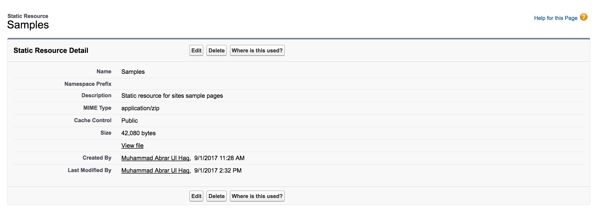
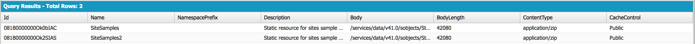

# SFDC-static-resources

Salesforce Static Resources from all perpsectives:

#### StaticResource object Fields
https://developer.salesforce.com/docs/atlas.en-us.api_tooling.meta/api_tooling/tooling_api_objects_staticresource.htm  

<i>SELECT Id, Name, Description, NamespacePrefix, Body, BodyLength, ContentType, CacheControl FROM StaticResource</i>

#### Calculate the overall size of the StaticResources within an Org
<i>SELECT SUM(BodyLength) FROM StaticResource where NamespacePrefix = Null</i>

Note: This will return the results in Bytes and then you have to convert it into Megabytes to get it in MB.

#### How to access static resources from Apex, Visualforce and Custom Button
https://www.xgeek.net/salesforce/access-static-resources-from-apex-visualforce-and-custom-button/
